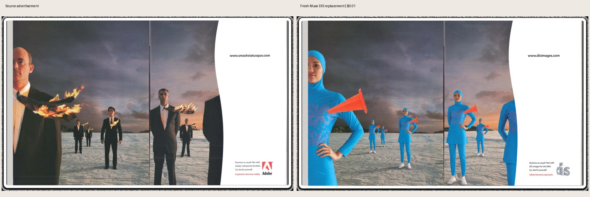
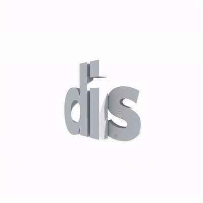

# Fresh Muse and Seedance examples

Generated on 10 September 2026 through the installed tool for [#94](https://github.com/Reid-Surmeier/Image-generation-pipline/issues/94). **Both are unapproved candidates. The generation routes ran, but visual qualification is not a clean pass.**

## Muse — Safety becomes spectacle

[Full Muse output](muse-result.webp) · [Original advertisement](muse-source.jpg) · [DIS subject reference](dis-reference.jpg)

One fresh Muse request replaced the seven suited figures and burning ties with the supplied DIS subject and orange cones. The website, paragraph, tagline and DIS mark were changed. Actual cost: **$0.01**.

The independent review found scale/cropping and pose/expression drift: the figure right of the gutter gains visible feet where the source crops it. Muse returned 2032×1216 for a requested 2000×1198. This is a generative full-page replacement; exact pixel preservation is unverified. No refinement or retry was submitted.

## Seedance — DIS hover icon

[Original provider MP4](seedance-original.mp4) · [Source anchor](seedance-anchor.png) · [Sampled frames](seedance-frames.jpg)

One fresh four-second silent study used Seedance 2.0 Mini, both frame anchors and the matching vertical-motion reference. The existing strategy gate passed with no waiver. The original video has not been resized or retouched; only this GIF preview is resized for display.

**Verification failed:** requested 720×720, received **960×960**. Duration (4.041667 seconds) and no-audio checks passed. Near-end anchor RMSE was 17.87 and loop RMSE 15.90; inspecting the actual final decoded frame confirms the drift. Independent blind review measured approximately **133 pixels of vertical travel** against the requested 14-pixel rise, plus timing, shading and background drift. Both fresh reviewers returned **fail** against the supplied briefs. These diagnostic values do not grant visual approval.

Provider-reported cost: **$0.30555** against the live plan's $0.1021 estimate. Frame anchors and video reference were sent using the existing experimental mixed-input option; reference influence remains uncertain because the provider may prioritize anchors.

## Port and run evidence

The fresh unpaid original-versus-ported replay passed again: equal edit/composite/refinement requests, six matching product packets, ten matching prompts, and byte-identical deterministic Assembly with **zero changed pixels outside declared masks** and 97.5% OCR coverage. That establishes preservation of the saved code path; it does not approve these new probabilistic outputs.

[Port replay](port-replay.json) · [Requests, hashes, reservations, checks and costs](evidence.json) · [Failure follow-up #95](https://github.com/Reid-Surmeier/Image-generation-pipline/issues/95)

Total actual spend: **$0.31555**, one Muse request and one Seedance submission, no retries. Full inputs, native outputs and append-only records remain in the DIS application at `/home/reidsurmeier/vibe-dis-composites-five-source/docs/prototypes/pipeline-live-proof-20260910`. These files are exports for PR comparison, not application assets promoted to approved outputs.

Installed runtime: commit `7713960a7f1a88424e655d0f0ac013872259158f`, artifact `2b9539945fad934f9126324da4d65c05008c98a5b05d92874b91fbe9f8544534`. No runtime code, gates or creative procedures changed during this qualification. No release or merge is included.

Repository verification: `scripts/verify.sh` passed on the evidence tree (254 Python tests, 19 Node tests, 214 control-plane passes with one intentional skip); the evidence secret scan found no leaks. These code checks do not override the two visual review failures above.
