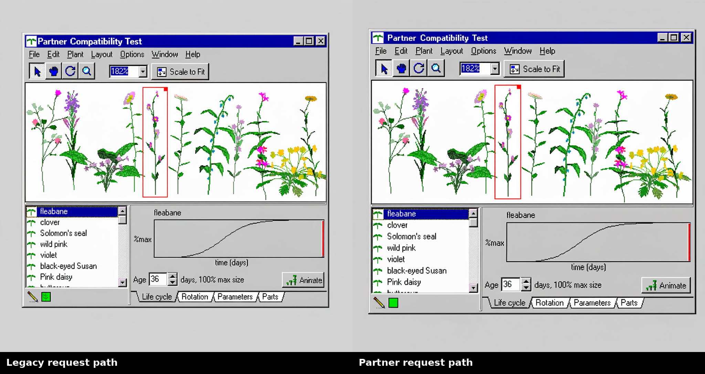

# Issue 32 paid Partner request-path side-by-side

## Result

The Partner-compatible controls do not change the OpenRouter provider request.
The legacy and Partner request-construction paths encoded the same reference PNG
and serialized byte-identical complete requests.
The two returned images differ, despite the same request and seed, so their
pixel differences cannot be attributed to the node interface. They demonstrate
that this provider run was not repeatable from the exposed seed alone.

Both outputs visibly made the requested title-bar edit to `Partner Compatibility
Test`, kept the PlantStudio interface recognizable, and placed the complete
window on a light-gray square canvas. The native renders differ in window scale,
spacing, and local redraw details. Neither image is evidence of exact-pixel
preservation; human visual approval remains required.

- [Legacy request-path output](legacy/image-01.png), 1024 x 1024 PNG
- [Partner request-path output](partner/image-01.png), 1024 x 1024 PNG

## Controlled method

- Immutable source: `artifacts/references/plantstudio-main-window.png`
- Source SHA-256: `c9ddeaa3cd27d0d5b502710ad12bc8f810529339c87b97a289b6d6932df8f45d`
- Provider/model: OpenRouter / `qwen/qwen-image-3-pro`
- Resolution/aspect ratio: 1K / 1:1
- Seed: `2026082632`
- Output count: one per arm, two total
- Negative prompt: empty
- Prompt expansion: false
- Watermark: false
- Full request SHA-256: `e5572fa96ce00b7dc65a8c2dcdb33470ee7f600252e994a1cf6191dd9b3bc072`
- Reference encoding SHA-256: `ff7e892704714317cc365c0e96acf0355a14b29eb0ebf2f9beb254539a59f59f`

The script used the actual legacy and Partner reference encoders, asserted that
their data URLs matched, built both requests, and asserted complete request
equality before payment. It then submitted each request exactly once. No retry
or follow-up generation was performed.

The paid harness called the same encoding, brief, and OpenRouter request builders
as the two nodes, but submitted the proven-equal requests directly rather than
queueing a production ComfyUI graph. This isolates the provider-facing interface
mapping. A no-cost replay then ran the saved responses through the actual
`QwenImage3Render` and `QwenImage3Edit` classes, captured their outgoing request
objects, proved both match the paid request hash, and proved their IMAGE tensors
match the saved native images pixel-for-pixel. `node-replay.json` records that
result. The saved-workflow and temporary-ComfyUI checks elsewhere in this branch
cover canvas wiring and node execution separately.

The paid submissions ran from code base commit
`1b600571a36dc4671efaafabe374216b1afc3357` with an untracked issue-specific
harness. The original harness did not persist a pre-submit attempt sentinel;
`execution.json` discloses that limitation and assigns traceable retrospective
attempt IDs from the retained response timestamps and request hash. The committed
harness now writes a crash-safe sentinel before every paid call, refuses to
prepare or execute over existing evidence, and has focused state-machine tests.
These safeguards were added after the completed pair and are not claimed as
controls that existed during it.

## Cost and provenance

| Arm | Requested | Completed | UTC completion | Output SHA-256 | Cost |
| --- | ---: | ---: | --- | --- | ---: |
| Legacy request path | 1 | 1 | 2026-08-27T02:18:17Z | `309a93fa9d9f74b186f73665d0d2fdbcb54b5f846b1ca2ac19fe160aa12d4b0c` | $0.043 |
| Partner request path | 1 | 1 | 2026-08-27T02:20:35Z | `8490e9e0a94a0df986057215b4b64d8ec48480d73d37d7f24ac5d21bdf542e8b` | $0.043 |

Estimated total was $0.083; actual provider-reported total was $0.086. There
were no ambiguous or possibly billed failures. `comparison.json` is the summary
manifest; `execution.json` distinguishes the two submissions and records their
code-state limitation. Each arm retains its attempt record, sanitized request,
sanitized response, brief, prompt, run metadata, and native image. Embedded
reference bytes and credentials are not stored in metadata.
